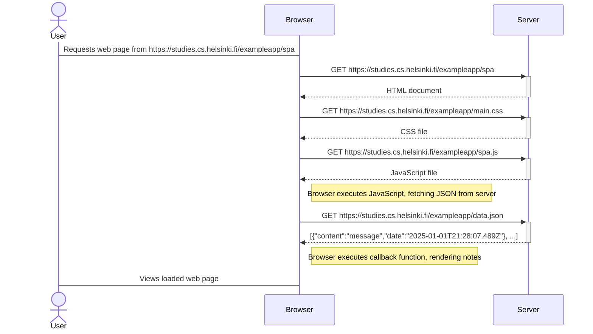

```mermaid
sequenceDiagram
    actor u as User
    participant a as Browser
    participant b as Server

    u->a: Requests web page from https://studies.cs.helsinki.fi/exampleapp/spa

    a->>+b: GET https://studies.cs.helsinki.fi/exampleapp/spa
    b-->>-a: HTML document

    a->>+b: GET https://studies.cs.helsinki.fi/exampleapp/main.css
    b-->>-a: CSS file

    a->>+b: GET https://studies.cs.helsinki.fi/exampleapp/spa.js
    b-->>-a: JavaScript file
    Note right of a: Browser executes JavaScript, fetching JSON from server

    a->>+b: GET https://studies.cs.helsinki.fi/exampleapp/data.json
    b-->>-a: [{"content":"message","date":"2025-01-01T21:28:07.489Z"}, ...]
    Note right of a: Browser executes callback function, rendering notes

    a->u: Views loaded web page
```