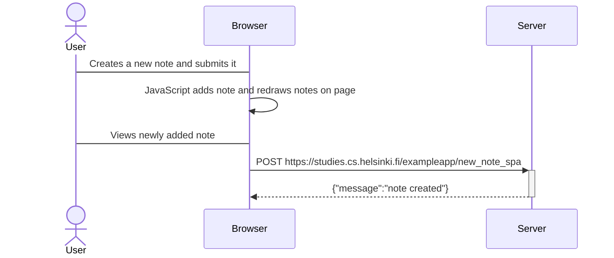

```mermaid
sequenceDiagram
    actor u as User
    participant a as Browser
    participant b as Server

    u->a: Creates a new note and submits it

    a->>a: JavaScript adds note and redraws notes on page

    a->u: Views newly added note

    a->>+b: POST https://studies.cs.helsinki.fi/exampleapp/new_note_spa
    b-->>-a: {"message":"note created"}
```